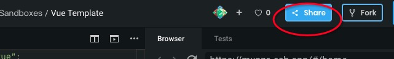
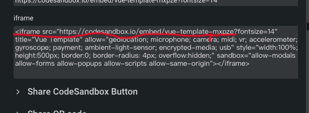

# wanted

> Created by [create-poi-app](https://poi.js.org).

## Project Scripts

### `npm run build`

Build app for production to `./dist` folder.

### `npm run dev`

Start a dev server to preview your app.

## How to use
### wanted.conf.js

  + `avatarConfig`为用户个性化姓名头像配置
  - `wanted`为每期主题题目简介等配置
  + `codeUrls`为每一期的所有成员配置

### markdwon

  + 编写请在`src/markdown`下的文件夹下建立自己的md文件
  - 文件名和`wanted.conf.js`中的设置的用户名保持一致

### code

  + 若是需要展示详尽代码，请预先在[CodeSandBox](https://codesandbox.io/)中写好, 同时将链接写在
    `codeUrls`配置中自己所属名下。
  - 链接规格参考下图

    ***找到分享***

    

    ***截取地址***

    

